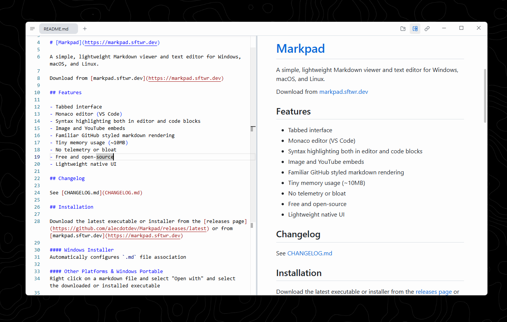

# Markdown Viewer

Everything you'd want from a simple markdown viewer.

## 📝 Basic Typography

You can use **bold text**, *italic text*, or ~~strikethrough~~.
Even ***bold and italic*** together.

## 📋 Lists & Checkboxes

### Unordered List
- Item 1
- Item 2
  - Sub-item A
  - Sub-item B

### Ordered List
1. First Step
2. Second Step
3. Third Step

### Checklists
- [x] Feature A implemented
- [x] Feature B implementation
- [ ] Upcoming feature

## 💡 Alerts

> [!NOTE]
> Lorem ipsum

> [!TIP]
> Lorem ipsum

> [!IMPORTANT]
> Lorem ipsum

> [!WARNING]
> Lorem ipsum

> [!CAUTION]
> Lorem ipsum

---

## 💻 Code Blocks

Indicate the language of the code block to enable syntax highlighting.

### Rust
```rust
fn main() {
    let message = "Hello, Markdown Viewer!";
    println!("{}", message);
}
```

### JavaScript
```javascript
const greet = (name) => {
    console.log(`Hello, ${name}!`);
};

greet('Viewer');
```

### Python
```python
def fibonacci(n):
    if n <= 1:
        return n
    return fibonacci(n-1) + fibonacci(n-2)

print(fibonacci(10))
```

---

## ➗ LaTeX Math

### Inline Math

Einstein's famous quote: "$E = mc^2$".

### Block Math

$$\frac{1}{2} < \left\lfloor \text{mod} \left( \left\lfloor \frac{y}{17} \right\rfloor 2^{-17 \lfloor x \rfloor - \text{mod}(\lfloor y \rfloor, 17)}, 2 \right) \right\rfloor$$

---

## 📊 Tables

| This | Is | A | Table |
| --- | --- | --- | --- |
| Lorem | Ipsum | Dolor | Sit |
| More | Lorem | Ipsum | Sample Text |


## 🔗 Media & Links

### Links
Check out [Tauri.app](https://tauri.app).

### Images


### Youtube Embeds
Just paste a Youtube link on its own line:

https://www.youtube.com/watch?v=dQw4w9WgXcQ


